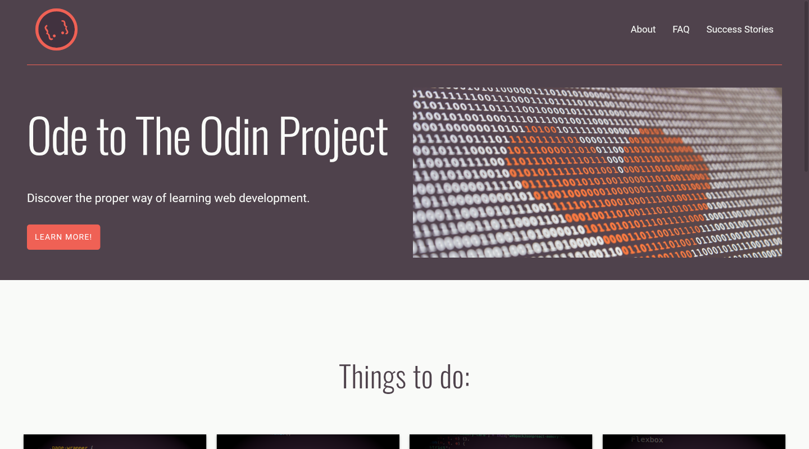

# The Odin Project - Landing Page

This is a basic page done as a part of The Odin Project's new curriculum. I thought I should do these lessons because I'm a completist.

## Table of contents

- [Overview](#overview)
  - [Description](#description)
  - [Screenshot](#screenshot)
  - [Links](#links)
- [My process](#my-process)
  - [Built with](#built-with)
  - [The process](#the-process)
  - [Useful resources](#useful-resources)
- [Author](#author)

## Overview

### Description

The aim of this project was to understand the basics of HTML and CSS, with focus on flexbox.

### Screenshot

### Links

- [Solution](https://github.com/je-jo/odin-landing-page)
- [Live Site](https://je-jo.github.io/odin-landing-page/)

## My process

### Built with

- Semantic HTML5 markup
- CSS3
- Flexbox

### The process

This was not as easy, because once again I've underestimated the power of forward-planning...

### Useful resources

- [Minireset](https://awesomeopensource.com/project/jgthms/minireset.css?categoryPage=29) - A tiny modern CSS reset. 
- [Colors from Paraiso theme](https://github.com/idleberg/Paraiso-Color-Palettes)
- [Original Photo by Alexander Sinn](https://unsplash.com/photos/KgLtFCgfC28?utm_source=unsplash&utm_medium=referral&utm_content=creditShareLink) recolored by me to match the rest of the page better. The rest of the pictures are screenshots by me.
- [This great article by Kevin Powell](https://www.kevinpowell.co/article/creating-a-website-getting-over-the-anxiety-of-starting-with-a-blank-file/) - A great starting point for new developers who struggle with planning their process.
- [Materialize.css box shadow](https://materializecss.com/)

## Author

- [Github](https://github.com/je-jo)
- [Frontend Mentor](https://www.frontendmentor.io/profile/je-jo)
- [Codepen](https://codepen.io/je-jo)